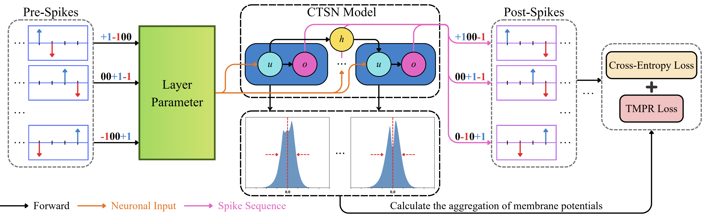

# Ternary Spiking Neural Networks Enhanced by Complemented Neurons and Membrane Potential Aggregation

Link to the paper:  

- [arXiv](https://arxiv.org/abs/2601.15598)

## Introduction

Spiking Neural Networks (SNNs) are promising energy-efficient models and powerful framworks of modeling neuron dynamics. However, existing binary spiking neurons exhibit limited biological plausibilities and low information capacity. Recently developed ternary spiking neuron possesses higher consistency with biological principles (i.e. excitation-inhibition balance mechanism). Despite of this, the ternary spiking neuron suffers from defects including iterative information loss, temporal gradient vanishing and irregular distributions of membrane potentials. To address these issues, we propose Complemented Ternary Spiking Neuron (CTSN), a novel ternary spiking neuron model that incorporates an learnable complemental term to store information from historical inputs. CTSN effectively improves the deficiencies of ternary spiking neuron, while the embedded learnable factors enable CTSN to adaptively adjust neuron dynamics, providing strong neural heterogeneity. Furthermore, based on the temporal evolution features of ternary spiking neurons' membrane potential distributions, we propose the Temporal Membrane Potential Regularization (TMPR) training method. TMPR introduces time-varying regularization strategy utilizing membrane potentials, furhter enhancing the training process by creating extra backpropagation paths. We validate our methods through extensive experiments on various datasets, demonstrating remarkable performance advances.  


## Datasets

- [CIFAR-10/100](https://www.cs.toronto.edu/~kriz/cifar.html)
- [ImageNet-100](https://www.image-net.org/challenges/LSVRC/2012/browse-synsets)
- [CIFAR10-DVS](https://figshare.com/s/d03a91081824536f12a8)

## Prerequisites

**Requirements:**  

The Following Setup is tested and it is working:  

- Python 3.12.3
- PyTorch 2.5.1
- torchvision 0.20.1
- CUDA 12.4

**GPU:**  

- NVIDIA RTX 4090D

## Get Started

**CIFAR-10:**  

```bash
python train.py --step 4 --complementary --loss tmpr --lamb 0.05 --dataset cifar10 --model resnet19
python train.py --step 4 --complementary --loss tmpr --lamb 0.05 --dataset cifar10 --model resnet20m
python train.py --step 6 --complementary --loss tmpr --lamb 0.05 --dataset cifar10 --model resnet20m
```  

**CIFAR-100:**  

```bash
python train.py --step 4 --complementary --loss tmpr --lamb 0.05 --dataset cifar100 --model resnet19
python train.py --step 4 --complementary --loss tmpr --lamb 0.05 --dataset cifar100 --model resnet20m
python train.py --step 6 --complementary --loss tmpr --lamb 0.05 --dataset cifar100 --model resnet20m
```  

**ImageNet-100:**  

Distributed training with 8 GPUs:  

```bash
python -m torch.distributed.launch --nproc_per_node 8 --nnode 1 --master_port=25641 train_distribute.py --step 4 --complementary --loss tmpr --lamb 0.05 --dataset imagenet100 --model resnet34
python -m torch.distributed.launch --nproc_per_node 8 --nnode 1 --master_port=25641 train_distribute.py --step 4 --complementary --loss tmpr --lamb 0.05 --dataset imagenet100 --model sewresnet34
```  

Parallel training (assuming there are 2 available GPUs):  

```bash
python train.py --step 4 --complementary --loss tmpr --lamb 0.05 --dataset imagenet100 --model resnet34 --parallel --gpu 0-1
python train.py --step 4 --complementary --loss tmpr --lamb 0.05 --dataset imagenet100 --model sewresnet34 --parallel --gpu 0-1
```  

Our results in the parper are obtained through parallel training with 2 NVIDIA RTX 4090D GPUs.

**CIFAR10-DVS:**  

```bash
python train.py --step 10 --complementary --decay_parameters --loss tmpr --lamb 0.01 --dataset cifar10-dvs --model vgg16 --weight_decay 5e-4
python train.py --step 10 --complementary --decay_parameters --loss tmpr --lamb 0.01 --dataset cifar10-dvs --model resnet20m --weight_decay 5e-4
```  

## Acknowledgement

This repository is based on [Ternary-Spike](https://github.com/yfguo91/Ternary-Spike)(@yfguo91), [Parallel-Spiking-Neuron](https://github.com/fangwei123456/Parallel-Spiking-Neuron)(@fangwei123456), and [SpikingJelly](https://github.com/fangwei123456/SpikingJelly)(@fangwei123456) thanks for their great work.

## Citation

```bibtex
@article{zhang2026ternary,
  title={Ternary Spiking Neural Networks Enhanced by Complemented Neurons and Membrane Potential Aggregation},
  author={Zhang, Boxuan and Wang, Jiaxin and Xu, Zhen and Tao, Kuan},
  journal={arXiv preprint arXiv:2601.15598},
  year={2026}
}
```
